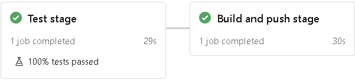
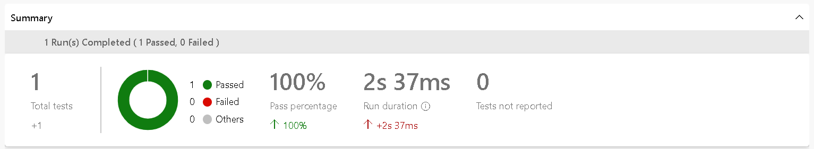
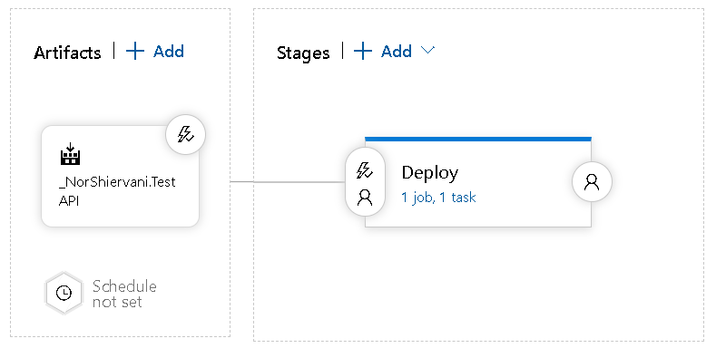
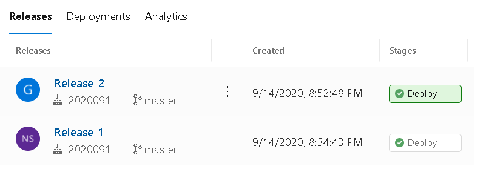

**DESSA UPPGIFTER GENOMFÖRDES I SAMARBETE MED ANDRÉ MORAD (B12)**

##  **Azure pipeline** 

**Bakgrund** 

En pipeline definieras som en tjänst som automatiserar processen att bygga och testa kod och göra dessa kod tillgängliga för andra människor. Microsoft erbjuder en sådan pipeline i sin molntjänst, som kallas "Azure pipelines".  Azure-pipeline följer två metoder; continuous integration (CI) och Continuous delivery (CD). Continuous integration (CI) handlar om att automatisera processen att bygga och testa kod i ett repo när en ny förändring har gjorts. Continuous delivery (CD) automatiserar processen för att kontinuerligt leverera kod som har passerat tester till produktion.


**Skapa pipeline** 

Först behövde vi skapa vår eget API-projekt. Detta löste vi genom att använda ett exempelprojekt skapat av Microsoft (https://docs.microsoft.com/en-us/aspnet/core/tutorials/first-web-api?view=aspnetcore-3.1&tabs=visual-studio-code). Därefter behövde vi skapa vår Docker-fil vilket innehöll instruktioner hur image skulle skapas och köras. Instruktionerna var likt förra Docker-filen som vi använde under lektion 3. Enda instruktionen som behövde ändras var COPY eftersom vi hade Dockerfilen utanför API-projektet. Vi skapade även en enkel unit test för projektet. Efter detta var klart så skapade vi en ny repo i Github och pushade in alla filer.


Efter detta var klart så kunde vi skapa vår Azure pipeline. Vi navigerade till Azure Devops och skapade vår nya projekt "cloudassignment". Därefter skapade vi vår nya pipeline. Först behövde man ange vår kod fanns (detta fallet var det i GitHub), sen behövde vi välja vår repository (TestAPI), sen ange att vi ville bygga och pusha en Docker image till ACR, därefter anger vi image namn och ACR-detaljer. När detta var klart så presenterade Azure vår pipeline yaml-fil.


**Pipeline filen** 

Likt Docker-filen så innehåller Pipeline-filen instruktioner, men i detta fall handlar dessa instruktioner om hur CI/CD processen ska ske. Den mest noterbara delen i Pipeline-filen är de olika steg "stages". Dessa steg instruerar pipeline vilka uppgifter den ska göra genom, dessa uppgifter (task) kan till exempel vara att bygga en webbapplikation, eller även som vi har valt att göra, köra unit tester. I vår fall så skapade Azure fördefinierade steg och uppgifter för Pipeline-filen vilken var att bygga och pusha image till vår ACR. Förutom att bygga och pusha vår image så behövde vi även kör vår unit test. Detta krävdes att vi behövde ändra Pipeline-filen vilket innehöll: fasen (task) att använda dotnetcore CLI, vilken kommando (command) vi ville köra samt var projektmappen låg för unit test (projects). Våra två faser, inkl. unit test, i Pipeline-filen såg således ut såhär:


```yaml
stages:
- stage: Testing
  displayName: Test stage
  jobs:  
  - job: Testing
    displayName: Testing
    steps:
    - task: "DotNetCoreCLI@2"
      displayName: Run unit tests of the project.
      inputs:
        command: test
        projects: $(testfilePath)

- stage: Build
  displayName: Build and push stage
  jobs:  
  - job: Build
    displayName: Build
    pool:
      vmImage: $(vmImageName)
    steps:
    - task: Docker@2
      displayName: Build and push an image to container registry
      inputs:
        command: buildAndPush
        repository: $(imageRepository)
        dockerfile: $(dockerfilePath)
        containerRegistry: $(dockerRegistryServiceConnection)
        tags: |
          $(tag)
```


Notera hur vi refererar till vår test-mapp, här använder vi en variabel som definierats i Pipeline-filen. Denna variabel `$(testfilePath)` definierade vi själva. Azure skapade andra fördefinerade variablar som till exempel imageRepository (namn på vår image), containerRegistry (vår ACR) och dockerfilePath (var vår Docker-fil är placerad).


```yaml
variables:

 # Container registry service connection established during pipeline creation

 dockerRegistryServiceConnection: 'b5d87616-f1a5-4c16-a1a4-c580951e49db'

 imageRepository: 'norshiervanitestapi'

 containerRegistry: 'ovning2.azurecr.io'

 dockerfilePath: '$(Build.SourcesDirectory)/DockerFile'

 testfilePath: '$(Build.SourcesDirectory)/UnitTests'

 tag: '$(Build.BuildId)'

 

 # Agent VM image name

 vmImageName: 'ubuntu-latest'
```


Andra viktiga delar i Pipeline-filen är "resources" och "trigger". I vår fall så handlar resource om vilken repository vår yaml-fil befinner sig i. Trigger handlar om att definiera vilka brancher som sätter igång en CI. Till exempel, om jag specifierar master som trigger så kommer pipeline köras varje gång någon commitar till master-branschen. Azure har redan definierat att commits till master-branschen (i vår repo) "triggar" en bygg. Om vi inte skulle specifiera en trigger så skulle en CI köras varje gång en person commitar till vilken bransch som helst i repot. 


```yaml
trigger:

- master


resources:

- repo: self
```


Efter Pipeline-filen var färdigredigerat så kunde vi skapa vår pipeline. Vi klickade på "Save and Run" vilket skapade ny Pipeline-fil och pushade upp det till vår repository (https://github.com/NorShiervani/TestAPI/). Azure körde därefter vår pipeline, allt lyckades! Pipeline körde även vår Unit test vilket även lyckades. Vår pipeline byggde alltså ny docker image och pushade upp det till vår ACR, samt körde vår Unit test.





[](https://dev.azure.com/norshiervani0999/cloudassignment/_build/latest?definitionId=6&branchName=master)

**Länk till vår pipeline:** https://github.com/NorShiervani/TestAPI/blob/master/azure-pipelines.yml


##  **Distribuera vår webbapplikation** 

**Release pipeline** 

Efter vi hade skapat vår pipeline så behövde vi även få Azure, efter varje bygg, distrubera vår webbapplikation (image) från vår ACR (Azure Container Registry) så att den kunde finnas i webben. Detta krävdes att vi skapade en så kallad "release pipeline". En release pipeline definieras som en process där kod flyttas ut i produktion, i vårt fall ville vi använda vår applikation för att publicera den på webben. 


För att skapa en release pipeline navigerade vi till vår Azure Devops projekt, klicka på "Release"-tabben och sedan skapa release pipeline.  Efter det lade vi till vår artifakt (vår pipeline), vi behövde ange källtyp vilket var "Build" samt vår källa vilket var "NorShiervani.TestAPI".  Sen var det väldigt vikigt att klicka på vår artifakt-tabell och aktivera "Continuous deployment trigger" så att den distribuerar efter varje bygg. Därefter behövde vi lägga till en fas ("stage") som skulle vara länkad till vår artifakt. Eftersom vi behövde distribuera vår webbapplikation så behövde vi klicka på fas-tabellen och välja "Azure App Service deployment" som en mall för fasen. Denna mall möjligjorde distributionen av vår webbapplikation. Vår release pipeline:





Fasen "Deploy" hade ett job och uppgift ("task"), denna uppgift var att "Deploy Azure App Service". Eftersom vi ville distribuera vår webbapplikation via Azure CLI:n så tog vi bort den existerande uppgift i "Deploy"-fasen och lade istället till "Azure CLI" som uppgift för fasen. Vi angav följande inline-skript för Azure CLI:


```bash
az container create --resource-group $(resourceGroup) --name aci-demo-app --image $(loginServer)/$(imageName):$(Build.BuildId) --registry-login-server $(loginServer) --registry-username $(acrUsername) --registry-password $(acrPassword) --dns-name-label testapinordns1 --ports 80
```


Notera hur vi använde variablar för att gömma känsliga detaljer, exempelvis lösenordet för vår ACR `$(acrPassword)`. För att kunna referera till dessa variablar så behövde vi lägga till de i tabben "Variables". Vi sparade därefter vår release pipeline och körde den, vilket resulterade i att den fungerade. Vi testade även att göra en commit i vår Github-respository för att se om release pipeline kördes, vilken den gjorde! :smiley:





