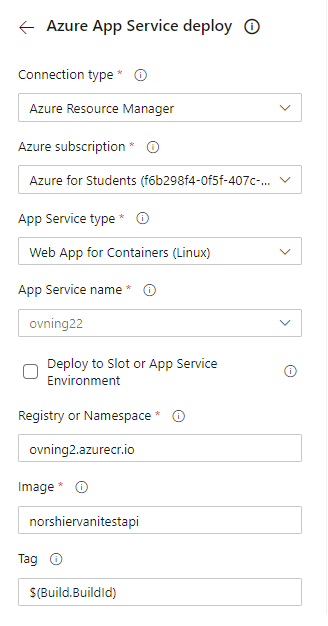
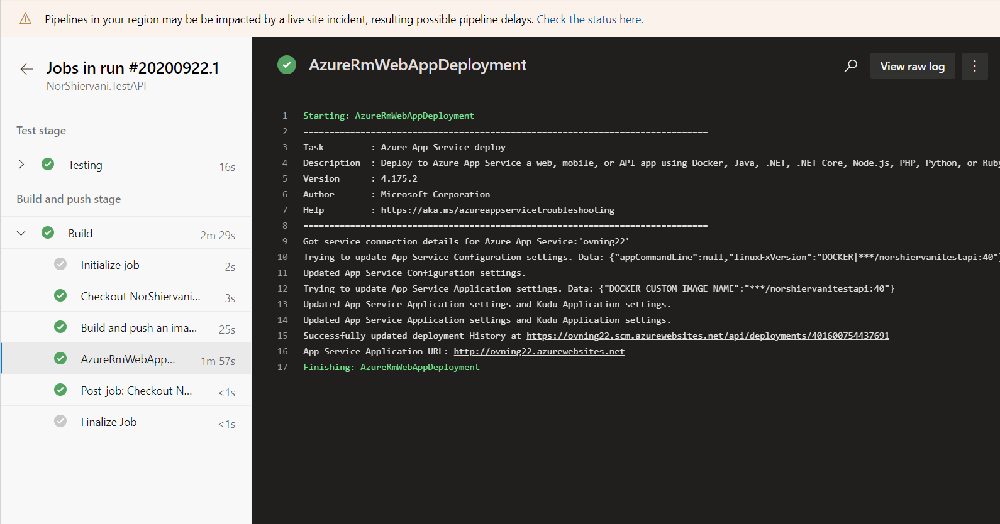
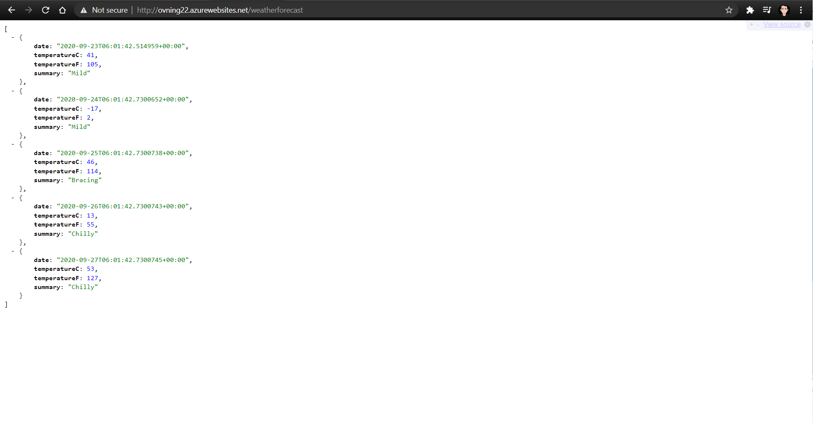

##  **Website pris** 

Vi började först med att utveckla olika priser för att hålla en webbplats online i Azure-molntjänster. Vi använder Aftonbladets besökardata som utgångspunkt för att ta reda på webbplatsens månatliga trafik.

**Webbsida: Aftonbladet.se**

Sida (ingen ad-block): https://www.aftonbladet.se/

Storlek (mb): 2.2MB

Besökare varje månad (icke-unika): 32.55 miljoner [Källa](https://annonswebb.schibsted.se/en/brands/aftonbladet-20/stats/aftonbladet-desktop-2032)

Total bandbredd varje månad: 71 610 000 MB (Storlek mb * Besökare varje månad)

 

**Virtuell maskin**

(Region: North Europe, Operating system: Windows, Type: (OS Only), Tier: Standard, Instance: D16ds v4, Virtual machines 1, Hours: 730, Saving options: Pay as you go, OS Windows: License included, Managed disks: SSD E60 x 1, Outbound data transfer: 72TB)

- Pris: $7754.81

 

**App service**

(Region: North Europe, Operating system: Windows, Type: (OS Only), Tier: Standard, Instance: S3, Hours: 730)

- Pris: $292

 

**Container instans**

(Region: North Europe, Operating system: Windows, Container groups: 1, Duration: 2678400, Memory: 14 GB, vCPU: 4)

- Pris: $295.44

  

**Kubernetes service (AKS)**

(Region: North Europe, Instance: D16ds v4, Saving options: Pay as you go, Managed disks: SSD E60 x 1, Uptime SLA: 1)

- Pris: $1423.24


##  **Azure App Service via Pipeline** 

Vi började med att navigera till vår projekt i Azure DevOps och redigerade vår existerande pipeline från [blogg 04](04.md). Därefter klickade vi på knappen "Show Assistant" åt höger av sidan, sökte efter tasken "Azure App Service deploy" och klickade på den. Denna task krävde att vi matade in följande detaljer för vår appservice; Azure subscription, App service type, App service name, Registry, Image och Tag. Vi satt förut fast med att deploya denna App service eftersom vi hade problem med vår Azure subscription och error i webbsidan ("Application Error") efter att den deployats. Problemet med subscription visade sig vara Azures' fel, men errorn i vår webbsidan efter deploy hade att göra med att vi angav fel "Tag" i denna "Azure App Service deploy"-tasken. Vi behöde ange `$(Build.BuildId)`, vilket var id för den slutförda bygget, i fältet "Tag" så att det fungerade.



Vi lade därefter till denna task genom att trycka på "Add" och producerade följande yaml-kod:

```yaml
    - task: AzureRmWebAppDeployment@4
      inputs:
        ConnectionType: 'AzureRM'
        azureSubscription: 'Azure for Students (f6b298f4-0f5f-407c-a479-abedb513de66)'
        appType: 'webAppContainer'
        WebAppName: 'ovning22'
        DockerNamespace: 'ovning2.azurecr.io'
        DockerRepository: 'norshiervanitestapi'
        DockerImageTag: $(Build.BuildId)
```

Därefter sparade vi pipeline-filen vilket resulterade till en push i repository vilket till slut ledde till att pipeline triggades och körde. Denna pipeline lyckades att bygga och deploya.



Vi testade därefter att besöka webbsidan, http://ovning22.azurewebsites.net/weatherforecast, vilket även fungerade. :smile:

